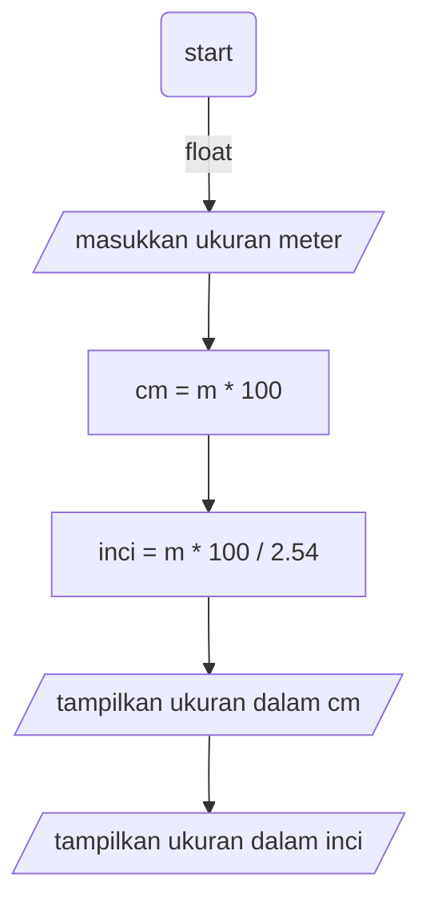

```mermaid
    flowchart TD;
    A(start) --float--> B[/masukkan ukuran meter/];
    B --> C[cm = m * 100];
    C --> D[inci = m * 100 / 2.54];
    D --> E[/tampilkan ukuran dalam cm/];
    E --> F[/tampilkan ukuran dalam inci/];
```