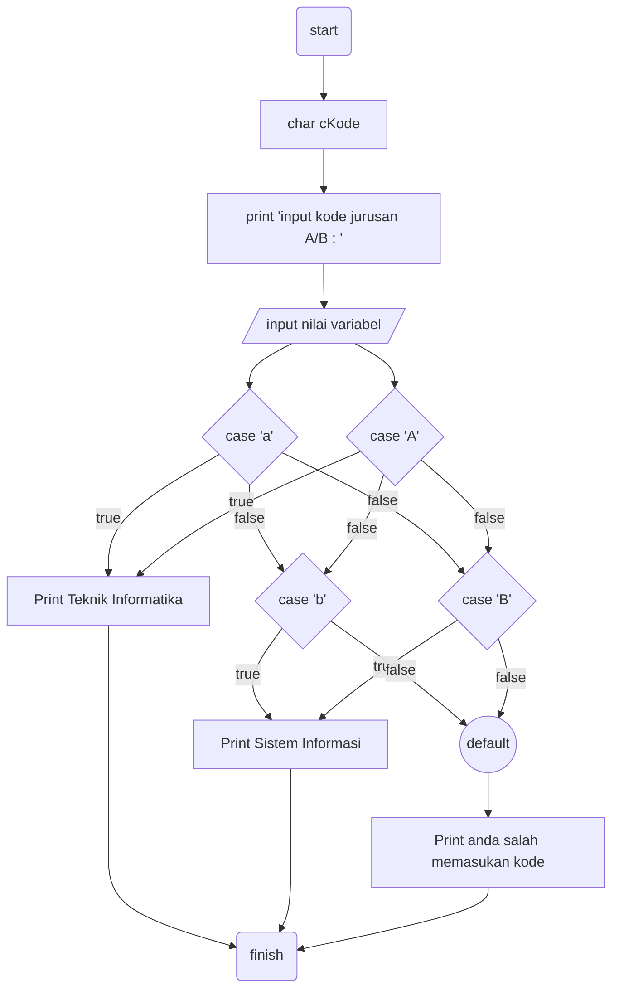

```mermaid
    flowchart TD;
    A(start)-->B[char cKode];
    B --> C[print 'input kode jurusan A/B : '];
    C --> D[/input nilai variabel/];
    D --> E{case 'A'};
    D --> F{case 'a'};
    F & E--true--> G[Print Teknik Informatika];
    F & E --false--> H{case 'B'};
    F & E --false--> I{case 'b'}
    I & H --true--> J[Print Sistem Informasi];
    I & H --false--> K((default));
    K --> Z[Print anda salah memasukan kode]
    G & J & Z --> L(finish);
```